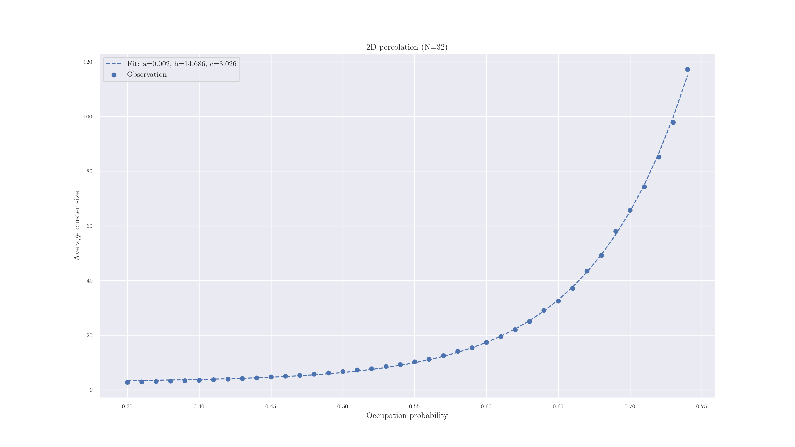
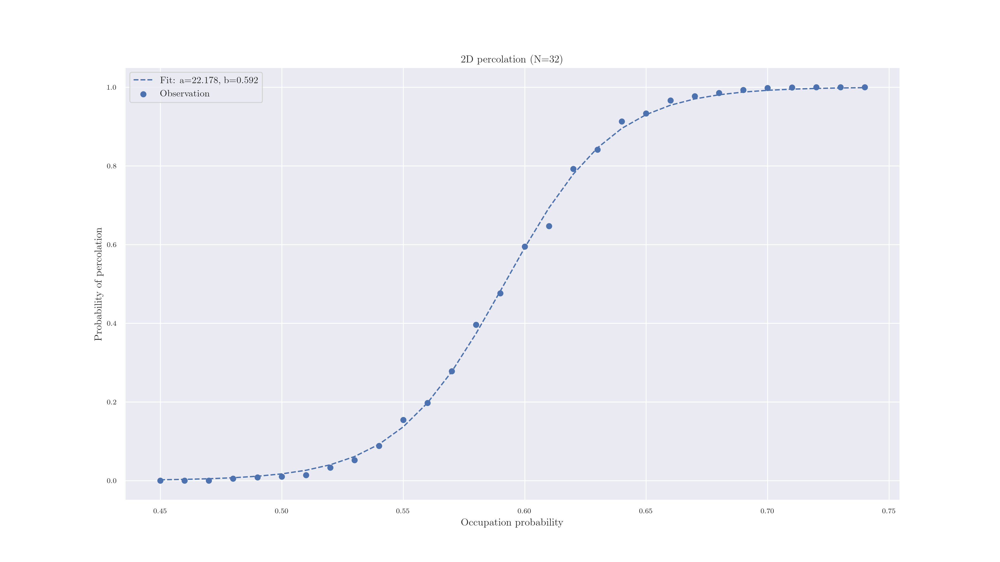

# Musk

Musk is a package to help you run physics/mathematics simulations. Given a simulation class and a set of parameters, it allows you to run simulations in parallel, store and retrieve the outputs of simulations, run analysis of simulations or simulation groups, and provides common aggregations and properties for seamslessly producing and reproducing  relevant outputs. Check out the  [examples](#examples) section to see what you can do with it! 

## Table of Contents

- [Installation](#installation)

- [Usage](#usage)

- [Examples](#examples)

  

## Installation
To install this package you can run `pip install musk`.

## Examples

#### 2D Percolation

This is just the classic percolation, in which we start with a square lattice of size N, and randomly set the state of each node to 1 with probability `p` and 0 with probability `1-p`. Some interesting quantities to look at are, for example, the average cluster size as a function of `p`:

  

as well as the percolation probability, i.e., the probability that there exists a cluster connection the top and bottom edges of the lattice, as a function of the occupation probability `p`:

#### Mandelbrot percolation

This is a type of percolation in which we subdivide each lattice site into sub-sites (normally each site becomes 4) multiple times. Each time, with probability *p*, we color each of the not yet colored sites. We end up with a self similar, fractal structure - hence the name.

The [percolation_mandelbrot_image.py](examples/percolation_mandelbrot_image.py) example produces an image of the lattice:

as well as the cluster size distribution and probability of percolation as a function of *p*:

